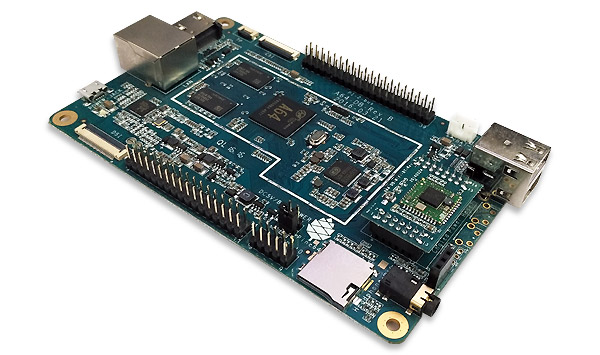

I often work with the [Yocto Project](https://www.yoctoproject.org/) to build custom Linux distributions for a
various range of products. One of the main struggles you can have while working with this tool is managing multiple
git repositories in order to produce a successful build. A new tool called [kas](https://github.com/siemens/kas) tries
to simplify this process; let's see how by building a distribution for a Pine64 board.

<!--truncate-->

## Installation

First, we must install python3 and pip, together with some other dependencies:

```bash
$ sudo apt install python3 python3-pip
$ pip3 install distro jsonschema PyYAML
```

Then install kas; I had a problem with a dependency so I had to install another package by hand

```bash
$ pip3 install testresources
$ pip3 install kas
```

## Running a simple build

As an example, we can try to build a simple image for the qemu machine which is already contained in the poky
repository. We need to create a special file, *kas-project.yml*, which will describe how our distribution must be built
and which layers must be included; we will use the file provided by the kas documentation, with some small tweaks.
Create a folder for the project:

```bash
$ mkdir kas-pine64
$ touch kas-project.yml
```

Add the following snippet to the project configuration file:

```yaml
header:
   version: 11
machine: qemux86-64
distro: poky
target: core-image-minimal
repos:
   kas-pine64:
   poky:
   url: "https://git.yoctoproject.org/git/poky"
   refspec: hardknott
   layers:
   meta:
   meta-poky:
   meta-yocto-bsp:
local_conf_header:
   kas-pine64: |
   EXTRA_IMAGE_FEATURES += "debug-tweaks"
```

The *kas-project.yml* file is written in [YAML](https://en.wikipedia.org/wiki/YAML), a minimal markup language often
used for configuration files. It allows us to describe our distribution in a very clear way; in this example we will be
building the *core-image-minimal* image based on the *poky* distribution for a *qemux86-64* machine. The layer used are
the ones contained in the *poky* layer, listed in the configuration file. The `local_conf_header` section allows
us to add any line to the *local.conf* file in the build folder.

We can now use one of the available *kas* commands, `build`:

```bash
$ kas build kas-project.yml
```

kas will clone the repositories indicated in out project file (just poky in this case) and start the build process
using `bitbake` for the *distro* and *machine* we set; at the end of the build process we will have a *build*
folder with the same structure of any Yocto project build.

## Other kas commands

One other useful kas command is `shell`. We can run it like

```bash
$ kas shell kas-project.yml
```

and what it does is it opens a new shell instance with the build environment loaded. We can also provide a custom
command to execute inside the new shell; for example to replicate the previous build command, we could run:

```bash
$ kas shell kas-project.yml -c "bitbake core-image-minimal"
```

Since we are running through the basic Yocto demo, we can now try to load the virtual QEMU image:

```bash
$ kas shell kas-project.yml
$ runqemu qemux86-64 core-image-minimal nographic
```

It will prompt for the admin password to create the tap interfaces, then, after the boot sequence, we can login with
"root" (since we enabled `debug-tweaks` in the project file). I also tried graphic mode but for some reason the
GUI never appears, maybe for some restrictions coming from the kas environment.

## Integrating with more layers



Now let's add some more layers to build an image for a real board, the
[Pine A64](https://www.pine64.org/devices/single-board-computers/pine-a64-lts/). Under the "repos" section of the
configuration file, add the following lines:

```yaml
   meta-openembedded:
     url: "https://github.com/openembedded/meta-openembedded.git"
     refspec: hardknott
     layers:
       meta-oe:
   meta-sunxi:
     url: "https://github.com/linux-sunxi/meta-sunxi.git"
     refspec: hardknott
```

We can add also one custom layer; it could be fetched from a private git repository, but it can be a simple folder in
the project structure as well:

```bash
$ mkdir meta-custom-pine64
```

Create also a *meta-custom-pine64/conf/layer.conf* file for our custom layer:

```
# We have a conf and classes directory, add to BBPATH
BBPATH .= ":${LAYERDIR}"

# We have recipes-* directories, add to BBFILES
BBFILES += "${LAYERDIR}/recipes-*/*/*.bb \
            ${LAYERDIR}/recipes-*/*/*.bbappend"

BBFILE_COLLECTIONS += "meta-custom-pine64"
BBFILE_PATTERN_meta-custom-pine64 = "^${LAYERDIR}/"
BBFILE_PRIORITY_meta-custom-pine64 = "10"

LAYERDEPENDS_meta-custom-pine64 = ""
LAYERSERIES_COMPAT_meta-custom-pine64 = "hardknott"
```

We can then add a new custom image creating the *meta-custom-pine64/recipes-images/images/kas-custom-image.bb* recipe:

```
SUMMARY = "kas custom image"
LICENSE = "MIT"

inherit core-image

IMAGE_FEATURES += "ssh-server-openssh"
```

Set the image as the build target by changing it in the project configuration file, and add the new layers as well; the
machine can be set to `pine64-plus`:

```yaml
...
machine: pine64-plus
distro: poky
target: kas-custom-image
...
# Add the new layer in our project section
repos:
  kas-pine64:
    layers:
      meta-custom-pine64:
```

The build process can be run again with:

```bash
$ kas build kas-project.yml
# Once the build process ends, we can flash the image
$ cd build/tmp/deploy/images/pine64-plus/
$ sudo dd if=kas-custom-image-pine64-plus.sunxi-sdimg of=/dev/sd<X> bs=1024 status=progress
```
If we boot the board using the flashed SD image, we will have a system with a basic image and an ssh server; this can
work as a canvas for more structured projects.

A small note: at the time of writing there is an issue with U-Boot in
[meta-sunxi](https://github.com/linux-sunxi/meta-sunxi) for the pine64-plus machine; I opened a
[pull request](https://github.com/linux-sunxi/meta-sunxi/pull/330) to fix that; apply that patch if you want to try to
build the project.
