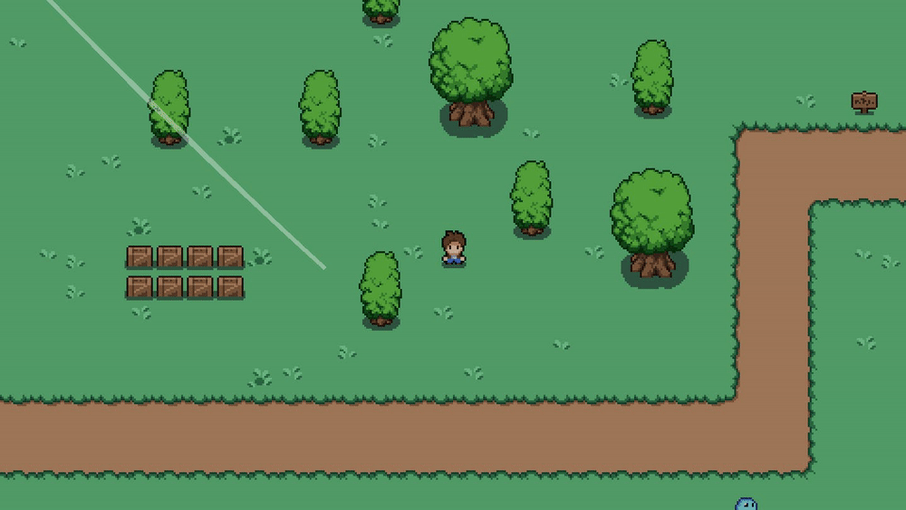
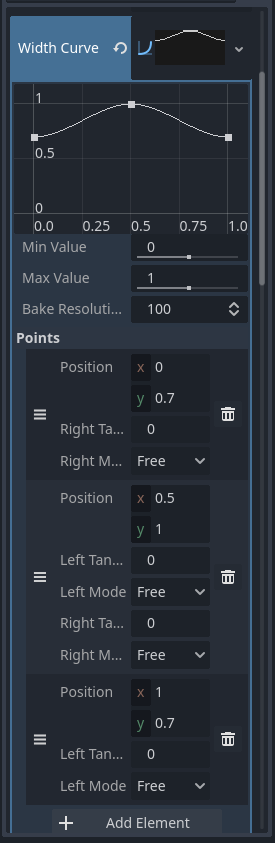
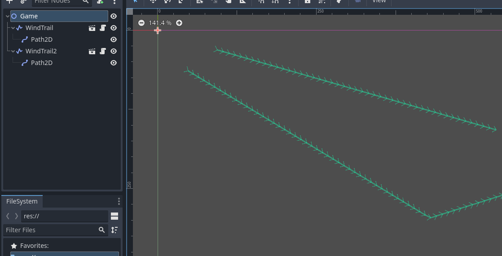

From first the moment I played [Titan Souls](https://www.youtube.com/watch?v=9AV4Cd7wdpA) for the first time, I fell in
love with its environment art. One detail caught my attention: the wind represented as trails over the scene. I tried to
recreate a similar effect in [Godot](https://godotengine.org/).

<!--truncate-->

I came up with this solution after watching [this tutorial](https://www.youtube.com/watch?v=0HCzL5ealtI); however the
effect didn't exactly match my desired outcome so I had to rework it a little bit.

The following GIF shows the end result (in which the effect was purposefully exaggerated with a long trail):



:::note

I used C# scripting to implement the solution, however the code from this article can be easily ported to GDScript.

:::

:::note

The whole thing has been developed on the latest Godot 4 stable version as of the time of writing.

:::

## The idea

The main idea is to use the native Line2D Godot node and create various "segments" to create the line movement. This
will be used together with a Path2D node and a list of PathFollow2D nodes to move the line points on the desired path.

The scene will be created without a predefined Path2D child node, and each scene which instantiate a "WindTrail" node
will have to provide the Path2D for that trail node.

## The implementation

Start by creating a new scene of type Line2D; rename the base node to "WindTrail" and save the scene as
`wind_trail.tscn`. Attach a C# script to it (rename it to `WindTrail.cs`) the add the following exports to configure
some of the trail properties:

```cs title="WindTrail.cs"
[Export]
private int segments = 30;
[Export]
private float pathLength = 15;
[Export]
private float pathSpeed = 200;
```

Then on the top of the script add the directive to include .NET collections, since we'll need to use a `List` for the
`PathFollow2D` nodes; also add such list and a property to keep a reference to a Path2D child node:

```cs title="WindTrail.cs"
/* On the top of the script */
using System.Collections.Generic;
...
/* Inside our custom node class */
// This will contain a reference to the Path2D node created
// by whoever instantiated the scene
private Path2D path2D;
private List<PathFollow2D> pathFollowList = new();
```

We'll use a method to dynamically add PathFollow2D children to the Path2D node; they should be distanced so that the
line has the desired length, and that will be tracked in the `Progress` property of each PathFollow2D node:

```cs title="WindTrail.cs"
private void InitPathFollowers()
{
    for (int i = 0; i < segments; i++)
    {
        var newPathFollow = new PathFollow2D();
        path2D.AddChild(newPathFollow);

        newPathFollow.Progress = (i / (float)(segments - 1)) * (-pathLength);
        newPathFollow.Loop = false;

        pathFollowList.Add(newPathFollow);
    }
}
```

Override the `_Ready` method to initialize the path followers:

```cs title="WindTrail.cs"
public override void _Ready()
{
    path2D = GetNode<Path2D>("Path2D");
    if (path2D == null)
    {
        GD.Print("missing Path2D child for WindTrail");
        return;
    }

    InitPathFollowers();
}
```

Now on each frame we need to advance the progress of the PathFollow2D nodes and to redraw the line according the their
updated position. Let's first implement the method to move the PathFollow2D nodes:

```cs title="WindTrail.cs"
private void MovePath(double delta)
{
    int firstUncompletePointIndex =
        pathFollowList.FindIndex(0, pathFollowList.Count, pf => pf.ProgressRatio < 1.0f);
    pathFollowList[firstUncompletePointIndex].Progress += (float)(pathSpeed * delta);

    for (int i = firstUncompletePointIndex + 1; i < segments; i++)
    {
        pathFollowList[i].Progress =
            pathFollowList[i - 1].Progress - (((i / (float)(segments - 1)) * (pathLength)));
    }
}
```

For the effect that we want to achieve we should find the first PathFollow2D node which hasn't reached the Path2D end;
then such node should be advanced according to the configured speed and each node after that based on the trail length.
This way the trail will "compress" toward the path's end.

Then we also need a method to redraw the line based on the update position of the PathFollow2D nodes:

```cs title="WindTrail.cs"
private void DrawPath()
{
    ClearPoints();

    foreach (var pathFollow in pathFollowList)
    {
        AddPoint(pathFollow.GlobalPosition);
    }
}
```

Let's put it together to advance the trail on each frame:

```cs title="WindTrail.cs"
public override void _Process(double delta)
{
    if (path2D == null)
    {
        return;
    }

    MovePath(delta);
    DrawPath();
}
```

Let's also edit some of the Line2D properties: in the Inspector tab change the line width to 5px, then create a new
*Width Curve* by clicking on the empty box and selecting "New curve". Add 3 points by clicking "Add element" and set
their values as given in the following image:



This will give the wind trail a little bit of width variation while it's moving.

## Using the WindTrail scene

Now when we need to show a new wind trail on our game scene we can just instantiate a WindTrail node, add a Path2D
child with a configured path and the effect will be shown on the scene startup.



## Improvements

Possible improvements would be:

* adding an auto-clean feature, so that the WindTrail node gets freed as soon as the trail reaches the end; this can be
  done easily by adding a couple of lines of code at the end of the `MovePath` method:

  ```cs
  // Check if the last PathFollow2D node has reached the end of the trail
  if (pathFollowList[pathFollowList.Count - 1].ProgressRatio >= 1.0f)
  {
      QueueFree();
  }
  ```

* having a method to start/restart/stop the trail programmatically, so that we can instantiate a number of wind trails
  in our scene and having something like a `WindTrailController` node which randomly starts one or more of those trails
