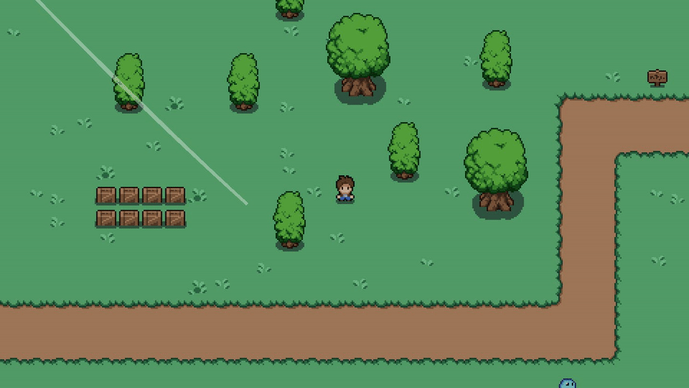

From the moment I played [Titan Souls](https://www.youtube.com/watch?v=9AV4Cd7wdpA) for the first time, I fell in love
with the environment art and one detail caught my attention: the wind represented as trails over the scene. I tried to
recreate a similar effect in Godot.

<!--truncate-->

I came up with this solution after watching [this tutorial](https://www.youtube.com/watch?v=0HCzL5ealtI); however the
effect didn't exactly match my desired outcome so I had to rework it a little bit.

The following GIF shows the end result (in which the effect purposefully exaggerated):

:::info

I used C# scripting to implement the solution, however the code from this article can be easily ported to GDScript.

:::

## The idea

